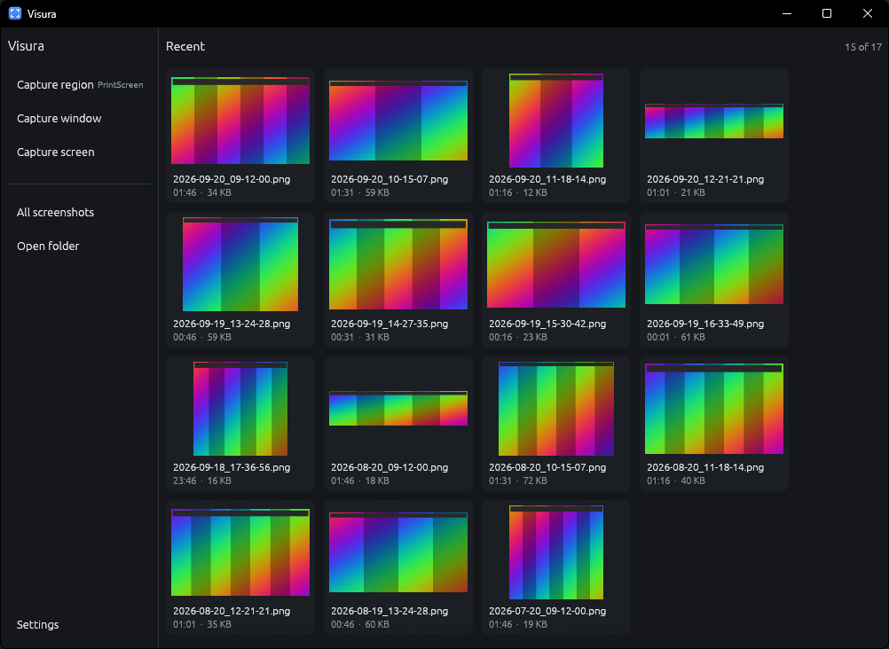
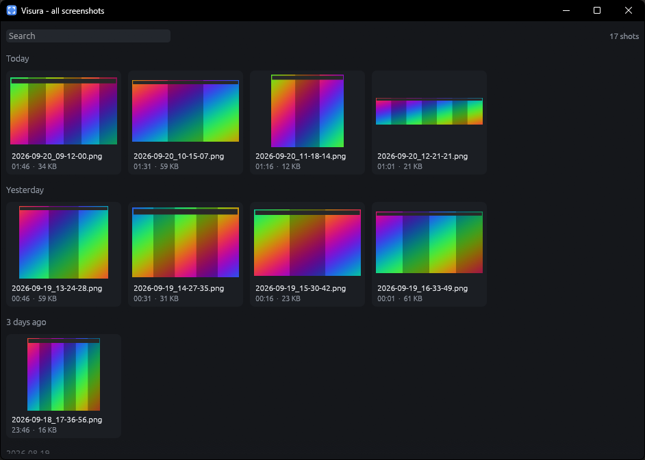
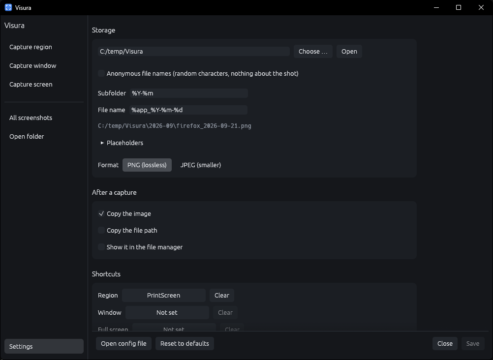
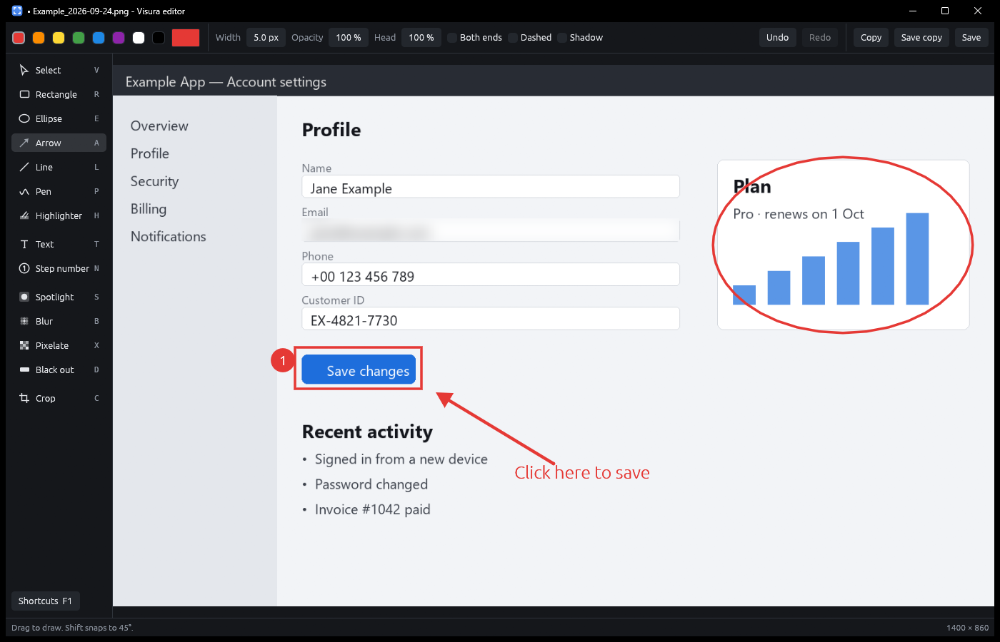

# Visura

A small screenshot tool for Windows and Linux.

Press a key, drag a box or click a window. The shot lands in a dated folder and
on the clipboard, and the window keeps the last few within reach.

<br clear="left">



## Features

- Region, window and full screen capture on a global shortcut, working
  whatever the window is doing, including minimised
- Selection overlay on a frozen frame: the window under the cursor gets a
  moving dashed outline that travels to the next one instead of jumping
- Holding `Ctrl` outlines the pane under the cursor instead of the whole
  window where the program has panes, for example the page in Chromium based
  browsers and Electron apps without the tabs and address bar around it
- File names built from the program and the date, for example
  `Firefox_2026-09-21.png`, or random characters when names should say nothing
- Recent shots in the main window, the full library in a separate window with
  search and day headings
- Drag a shot out of the list into another program
- A built-in viewer with zoom, and an editor for arrows, shapes, text, step
  numbers, highlighting, spotlight, blur, pixelation, black boxes and cropping
- Delete moves to the recycle bin
- Optionally, shots taken in a session go to the recycle bin when Visura quits,
  and shots older than a set number of days are moved there automatically
- `visura --shot region|window|screen` for binding a key in the desktop's own
  settings; a running Visura takes the shot
- Dark, black and light themes, seven accents

No upload, no account, no sharing. Screenshots go into a folder and stay
there.

The full library, with search and day headings, opens in a window of its own:





## Install

**Windows** — download `VisuraSetup.exe` from the
[latest release](../../releases/latest) and run it. It installs per user, needs
no administrator rights, and appears in Installed apps for removal. A newer
release installs over the old one and keeps the settings.

`Visura.exe` in the same release is the same program without an installer.

Neither is code signed, so SmartScreen warns once: "More info" → "Run anyway".

**Linux** — build from source, see below. There is no package yet.

## Using it

Only region capture has a shortcut out of the box: `Print`. The other two are
unbound and start from the sidebar until a shortcut is set in the settings.

In the overlay:

| Action | How |
|---|---|
| Free region | Drag |
| A window | Move the mouse over it and click the outline |
| A pane inside a window | Hold `Ctrl` and click |
| Everything | `Space` |
| Take the current outline | `Enter` |
| Cancel | `Esc` or right-click |

In the lists:

| Action | How |
|---|---|
| View | Double-click |
| Edit | Select, then `Edit`, or right-click → `Edit` |
| Select several | `Ctrl`-click, `Shift`-click, `Ctrl+A` |
| Drag into another program | Drag a tile |
| More | Right-click |
| Delete | `Del` |
| Clear the selection | `Esc` |

Flags:

- `--background` starts without a window
- `VISURA_CONFIG=<path>` uses a different configuration file

## Where the files go

By default `Pictures\Visura\2026-09\Firefox_2026-09-21.png`. Both the folder
and the file name are patterns:

| Token | Meaning |
|---|---|
| `%app` | program the window belongs to |
| `%win` | window title |
| `%Y` `%y` | year, four or two digits |
| `%m` `%d` | month, day |
| `%H` `%M` `%S` | hour, minute, second |
| `%ms` | millisecond |
| `%w` `%h` | size in pixels |

A token with nothing to fill in leaves no gap: a full screen shot has no
program, so `%app_%Y-%m-%d` becomes just the date.

Anonymous names replace the pattern with twelve random characters. The folders
stay as they are, so a shot is still easy to find by when it was taken; it is
the file name that stops saying what it is. Nothing is written into the file
either: neither encoder emits a timestamp, a comment or EXIF.

There is no index and no database. Whatever happens to the folder in a file
manager is what the list shows next time it reads it.

## Viewer and editor

The viewer shows one shot: mouse wheel to zoom, drag to pan, `0` to fit, `1`
for actual size, arrow keys for the previous and next shot, `E` to edit.



The editor keeps every change as a separate object until the result is saved,
so anything can be selected, moved, resized, restyled or undone. Blur,
pixelation and black boxes are burnt into the pixels on saving; the original
text under them is not kept in the file.

Every tool keeps its own settings, and they are remembered between runs:

| Tool | Settings |
|---|---|
| Rectangle, ellipse | Colour, width, opacity, fill, dashed, shadow; corner radius for rectangles |
| Arrow | Colour, width, opacity, head size, heads at both ends, dashed, shadow |
| Line, pen | Colour, width, opacity, shadow; dashed for lines |
| Highlighter | Colour, width, opacity |
| Text | Colour, size, opacity, background, monospace, shadow |
| Step number | Colour, size, shadow |
| Spotlight | Dimming, round or rectangular |
| Blur, pixelate | Strength or block size |
| Black out | Colour |
| Crop | Free, 1:1, 4:3, 16:9 or 3:2 |

| Tool | Key | | Tool | Key |
|---|---|---|---|---|
| Select | `V` | | Step number | `N` |
| Rectangle | `R` | | Spotlight | `S` |
| Ellipse | `E` | | Blur | `B` |
| Arrow | `A` | | Pixelate | `X` |
| Line | `L` | | Black out | `D` |
| Pen | `P` | | Crop | `C` |
| Highlighter | `H` | | Text | `T` |

| Action | How |
|---|---|
| Colour | `1` – `8`, or the swatches |
| Thinner, thicker | `[` `]` |
| Square, circle, 45° | Hold `Shift` |
| Zoom | Mouse wheel, `Ctrl+0` fit, `Ctrl+1` actual size |
| Pan | Middle mouse, or `Space` and drag |
| Undo, redo | `Ctrl+Z`, `Ctrl+Y` |
| Copy the result | `Ctrl+C` |
| Save over the file | `Ctrl+S` |
| Save a copy | `Ctrl+Shift+S` |
| All shortcuts | `F1` |

## Configuration

`%APPDATA%\Visura\config.toml`, or `~/.config/visura/config.toml`. Everything
in it is in the settings screen as well; the file is there for editing by hand
and for copying a setup between machines.

```toml
folder = "C:\\Users\\you\\Pictures\\Visura"
subfolder = "%Y-%m"
filename = "%app_%Y-%m-%d"
anonymous_names = false
format = "png"
jpeg_quality = 90
keep_days = 0
autostart = false

[after]
copy_image = true
copy_path = false
open_folder = false
delete_on_exit = false

[hotkeys]
region = "PrintScreen"
window = ""
fullscreen = ""

[overlay]
dim = 0.55
magnifier = false
crosshair = true
detect_windows = true
panes_first = false
show_hints = false
hide_self = false

[ui]
theme = "dark"
accent = "grey"
thumb_size = 168.0
recent_count = 15
start_hidden = false
close_to_tray = false
confirm_delete = true
```

The editor writes its own `[editor]` section with the last tool and each tool's
settings; it is not shown here.

`keep_days = 0` keeps shots forever. `panes_first = true` makes a plain click
take the pane and `Ctrl` the whole window.

An empty shortcut means the action has none. A shortcut that cannot be read
falls back to its default instead of stopping the program.

If a shortcut never fires, something else already holds the key. On Windows 11,
Settings → Accessibility → Keyboard has a switch that gives `Print` to the
Snipping Tool.

## Known limits

The screen is read with GDI on Windows. A program that presents straight to the
display, which is what a full screen game or a hardware accelerated video
player does, can come back as a stale or black rectangle. Windowed and
borderless windowed modes are unaffected.

Mixed DPI across monitors is untested. The overlay is placed in physical pixels
and maps the selection from the window rectangle it actually got, so it should
hold up, but it has only been run on a single scale factor.

## Linux

X11 is the native path: it can read the whole screen and the geometry of every
window, which is what the overlay is built on.

On Wayland Visura runs through XWayland. Reading the screen is not allowed
there, so the capture goes through the desktop's own screenshot tool:
`spectacle` on KDE, `gnome-screenshot` on GNOME, `grim` (or `wayshot`) on Sway,
Hyprland and other wlroots desktops. One of them has to be installed. Display
scaling is handled: the frame from the tool may have more pixels than XWayland
counts, and selections are scaled into it.

| | KDE | GNOME | Sway, Hyprland |
|---|---|---|---|
| Region, full screen | yes | yes | yes |
| Window | yes, via `spectacle -a` | yes, via `gnome-screenshot -w` | yes, via the compositor |
| Window outlines in the overlay | no | no | yes |

Global shortcuts only reach Visura while an X11 window has the keyboard. Add a
shortcut in the desktop's keyboard settings that runs `visura --shot region`
(or `window`, `screen`) instead; it hands the request to the running Visura.

No tray icon on Linux. It would mean a GTK and libayatana-appindicator
dependency for one icon, so closing the window quits instead.

Dragging out of the list uses XDND, so it needs X11 or XWayland. Where no drag
can start, the file path goes to the clipboard instead.

Window outlining uses `_NET_CLIENT_LIST_STACKING`, so it needs a window manager
that sets it. Almost all do.

## Building

```
cargo build --release
```

Rust 1.85 or newer. No C toolchain, and no system libraries beyond X11 and a GL
loader on Linux:

```
libx11-dev libxcursor-dev libxrandr-dev libxi-dev libgl1-mesa-dev
```

Before a commit:

```
cargo fmt --all -- --check
cargo clippy --all-targets -- -D warnings
cargo test --all
```

## Licence

MIT, see [LICENSE](LICENSE).

Parts of this project were created with AI assistance.
